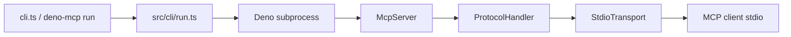

```bash
deno-mcp run --allow-read=./data ./server.ts
```

> This script gets filesystem access only because you said so.

# deno-mcp - Deno-native MCP with a default-deny sandbox

Ship [Model Context Protocol (MCP)](https://modelcontextprotocol.io) servers in Deno. Permissions are opt-in, not inherited.

Built on Web Streams and Deno's permission model. No Node shims.

## Install from GitHub

Not on JSR yet. Clone the repo or install the CLI from a pinned ref.

### Prerequisites

- [Deno](https://docs.deno.com/runtime/) 2.5+ (for `-P=` permission sets)

### CLI

```bash
git clone https://github.com/kellenff/deno-mcp.git
cd deno-mcp
deno task install-cli
```

Or install without cloning:

```bash
deno install --allow-run -n deno-mcp \
  https://raw.githubusercontent.com/kellenff/deno-mcp/main/cli.ts
```

Pin a commit or tag in production instead of `main`. Review the source before you run it.

### Library import

```typescript
import { McpServer } from "https://raw.githubusercontent.com/kellenff/deno-mcp/main/mod.ts";
```

Replace `main` with a commit SHA or tag when you deploy.

## Quick start

### Run the echo server (zero permissions)

```bash
deno-mcp run ./examples/echo_server.ts
```

No `--allow-*` flags. The server starts with no filesystem, network, or env access.

### Permission profiles in deno.json

This repo ships a named profile. That is what "Deno-native" means here: permissions live in config, not in ad hoc shell flags.

```json
{
  "permissions": {
    "mcp": {
      "read": ["./"],
      "env": true
    }
  }
}
```

```bash
deno-mcp run -P=mcp ./examples/echo_server.ts
```

### Write a server

For most use cases, start with `McpServer`. Use `ProtocolHandler` when you need a custom transport.

```typescript
import { McpServer } from "https://raw.githubusercontent.com/kellenff/deno-mcp/main/mod.ts";
import { z } from "zod";

const server = new McpServer({ name: "echo", version: "0.1.0" });

server.tool("echo", {
  description: "Echo a message",
  input: z.object({ message: z.string() }),
  handler: ({ message }) => ({
    content: [{ type: "text", text: message }],
  }),
});

if (import.meta.main) {
  await server.serveStdio();
}
```

Run it:

```bash
deno-mcp run ./my_server.ts
```

## Default-deny sandbox

You already saw the flags. Here is what they enforce.

| Principle | Detail |
| --------- | ------ |
| Default deny | `deno-mcp run` grants zero permissions unless you pass `--allow-*` or `-P=` |
| No prompts | `--no-prompt` is always injected. MCP clients use non-TTY stdio |
| Stdout is protocol | Never log to stdout. Use `log()` from the `/log` export (stderr) |
| Warn on `-A` | CLI warns when `--allow-all` is used |
| Message size cap | 10 MiB max per JSON-RPC line |

### Example permission sets

```json
{
  "permissions": {
    "mcp": {
      "read": ["./"],
      "env": true
    },
    "mcp-with-data": {
      "read": ["./", "./data"],
      "write": ["./data"],
      "env": true
    }
  }
}
```

```bash
deno-mcp run -P=mcp-with-data ./server.ts
```

Grant flags explicitly when you do not use a profile:

```bash
deno-mcp run --allow-read=./data --allow-env=HOME ./server.ts
deno-mcp run ./server.ts -- --verbose   # args after --
```

## Architecture



| Layer | Role |
| ----- | ---- |
| `McpServer` | Tools, resources, prompts with Zod validation |
| `ProtocolHandler` | JSON-RPC routing, initialize handshake |
| `StdioTransport` | Newline-delimited JSON-RPC over Web Streams |
| `Transport` | Pluggable interface (HTTP/SSE planned) |

## Cursor / Claude Desktop

```json
{
  "mcpServers": {
    "echo": {
      "command": "deno-mcp",
      "args": ["run", "/path/to/deno-mcp/examples/echo_server.ts"]
    }
  }
}
```

With permissions:

```json
{
  "mcpServers": {
    "my-server": {
      "command": "deno-mcp",
      "args": ["run", "--allow-read=./data", "/path/to/server.ts"]
    }
  }
}
```

## API reference

### `McpServer`

```typescript
const server = new McpServer({
  name: "my-server",
  version: "1.0.0",
  instructions: "Optional usage instructions for the client",
});

server.tool("name", {
  description: "...",
  input: z.object({ ... }),
  handler: (input) => ({ content: [{ type: "text", text: "..." }] }),
});

server.resource({
  uri: "file:///example.txt",
  name: "example",
  handler: () => ({ contents: [{ uri: "...", text: "..." }] }),
});

server.prompt({
  name: "greeting",
  handler: (args) => ({
    messages: [{ role: "user", content: { type: "text", text: "..." } }],
  }),
});

await server.serveStdio();
```

### Low-level exports

- `ProtocolHandler` - request routing without the high-level API
- `StdioTransport` - stdio transport for custom setups
- `ReadBuffer`, `serializeMessage`, `deserializeMessage` - protocol framing
- `McpError`, `ErrorCode` - JSON-RPC error handling

## Roadmap

| Status | Item |
| ------ | ---- |
| Now | Stdio transport, sandboxing CLI, tools/resources/prompts |
| Planned | HTTP/SSE transport (same permission model, remote deployment) |
| Planned | JSR publish (`@kellen/deno-mcp`) |

## Pick the right tool

| Use case | Recommendation |
| -------- | -------------- |
| Deno MCP with default-deny sandbox | **deno-mcp** (this repo) |
| Node API compatibility | `npm:@modelcontextprotocol/server` |
| Deno project dev tools (test, coverage) | `jsr:@udibo/deno-mcp` |

The Node SDK runs without Deno's permission sandbox. Any tool in that server process can access whatever the process already has.

## Development

```bash
deno task test         # 35 tests
deno task lint
deno task fmt
deno task dev          # watch echo server
deno task install-cli
```

## License

Public domain under [The Unlicense](https://unlicense.org). See [UNLICENSE](./UNLICENSE).
